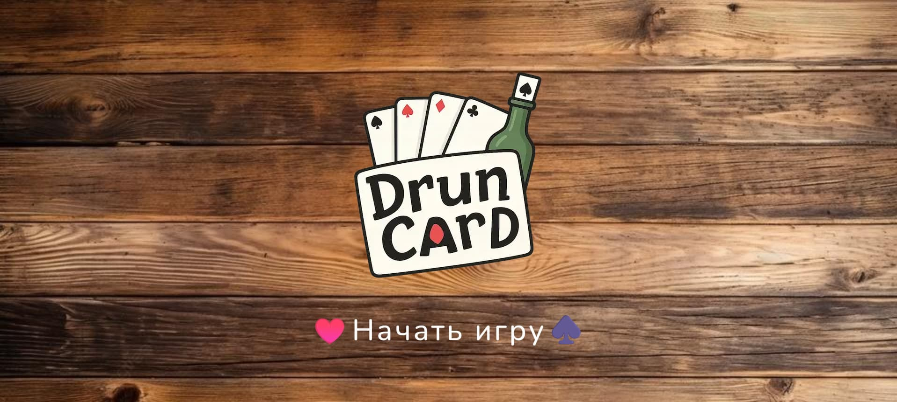
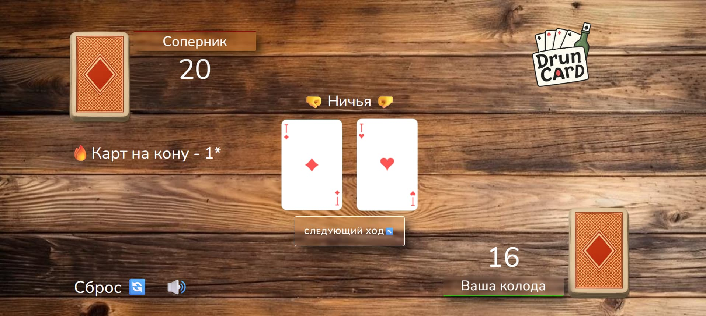

# 🎮 Druncard — Простая карточная игра

**DrunCard** — динамичная и захватывающая версия популярной карточной игры [_"Пьяница"_](<https://ru.wikipedia.org/wiki/%D0%9F%D1%8C%D1%8F%D0%BD%D0%B8%D1%86%D0%B0_(%D0%BA%D0%B0%D1%80%D1%82%D0%BE%D1%87%D0%BD%D0%B0%D1%8F_%D0%B8%D0%B3%D1%80%D0%B0)>), созданная для игры прямо в вашем браузере. Проект реализован с использованием JavaScript, HTML и CSS по современным стандартам веб-разработки.

## 🚀 Демонстрация

Попробуйте прямо сейчас: [DrunCard](https://druncard.netlify.app/)




### 🛠 Технологии


- JavaScript (ES6+) — логика игры, взаимодействие с DOM
- HTML5 & CSS3 — структура и стили
- Vite — быстрый сборщик проекта
- Оптимизация для современных браузеров
- Модульная архитектура и современный синтаксис ES6+
- Звуковые эффекты и музыкальное сопровождение для погружения
- Предзагрузка изображений для улучшения производительности

## ⚙ Запуск локально

1. Клонируйте репозиторий:

```bash
git clone git@github.com:Artem-WebDeveloper/druncard.git

```

2. Установите зависимости и запустите проект:

```bash
npm install
npm run dev
```

После этого проект будет доступен по адресу:

```arduino
http://localhost:5173/

```

Для сборки оптимизированной версии:

```bash
npm run build

```

Для предпросмотра сборки:

```bash
npm run preview

```

## 🃏 Правила игры "Пьяница"

### Цель игры — собрать все карты себе.

Как играть:

1. Колода из 36 карт делится поровну между двумя игроками (по 18 карт).
2. Игроки одновременно выкладывают по одной верхней карте.
3. У кого карта старше — тот забирает обе карты и кладёт их вниз своей стопки.
4. Если карты одинаковы по старшинству — ничья. Карты остаются на столе, и в следующем ходе победитель забирает все эти карты.
5. Игра продолжается, пока один из игроков не соберёт все карты.

### Старшинство карт (от младших к старшим):

6, 7, 8, 9, 10, Валет (J), Дама (Q), Король (K), Туз (A).
